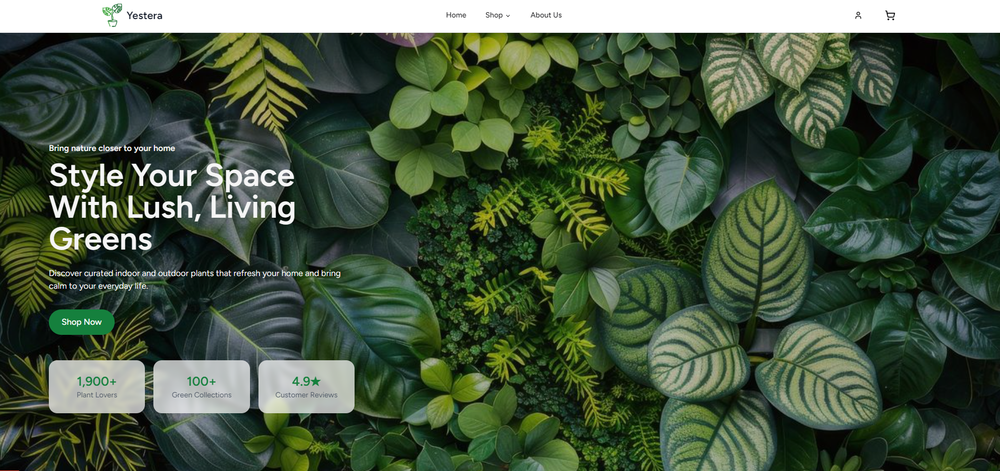

#  Yestera Web App



A modern web application for discovering and managing plants.  
Built using **Next.js (TypeScript)**, **Laravel**, and **Supabase** — combining clean UI, fast performance, and powerful backend integration.

---

##  Tech Stack

| Layer         | Technology               | Description                            |
|---------------|--------------------------|----------------------------------------|
| **Frontend**  | React.js(TypeScript)     | Main UI framework                      |
| **Styling**   | Tailwind CSS + shadcn/ui | Modern and responsive UI components    |
| **Backend**   | Laravel                  | RESTful API and business logic         |
| **Database**  | Supabase (PostgreSQL)    | Managed database and authentication    |
| **Auth**      | Laravel Breeze           | Secure user authentication             |
| **Icons**     | Lucide React             | Clean, lightweight SVG icon set        |

---


> [!TIP]
> Run both Laravel and Next.js servers together for a seamless development experience.  
> Use a proxy in Next.js to connect API calls to your Laravel backend automatically.

---

##  Getting Started (!Under Construction!)
> ⚠️ This section is still being prepared.  
> Instructions for setting up the frontend and backend will be added soon!

### 1. Clone the repository
```bash
git clone https://github.com/Aaronabil/plants.git
cd plants
```
### 2. Install dependencies
```bash
npm install
or
yarn install
```
### 3. Run the frontend
```bash
npm run dev
```
App will be available at http://localhost:3000

### 4. Start the backend (Laravel)
```bash
php artisan serve
```
Update your .env.local in the Next.js project to point API calls to Laravel.

---

##  Supabase Setup

1. Create a new Supabase project.
2. Copy your API URL and anon key.
3. Add them into .env.local:
```bash
NEXT_PUBLIC_SUPABASE_URL=your-url
NEXT_PUBLIC_SUPABASE_ANON_KEY=your-anon-key
```
4. Enable Email Auth or Social Login in Supabase settings.

---

##  Features

-  Browse curated plant collections  
-  Search and filter plants dynamically  
-  Transaction history tracking  
-  Editable user profile  
-  Auth integration via laravel breeze
-  Smooth frontend–backend synchronization  

---

##  Project Status

 Active Development — new features coming soon!  
 Currently improving profile editing and transaction history UI.

---
> [!Note]  
> Think of this project as a hybrid stack,
> Next.js delivers a sleek user interface,  
> Laravel powers backend business logic,  
> and Supabase bridges authentication and real-time data sync.

##  Author
Aaronabil, IsFaktuear, Alyysour.
- Ahmad Muqarrobin (242502040003)
- Muhamad Nabil Faiz Amarullah (242502040042)
- Alyssa Nurul Hidayat (242502040081)

---

[MIT](./LICENSE) License © 2025-PRESENT [Yestera Project](https://github.com/Aaronabil/plants)
